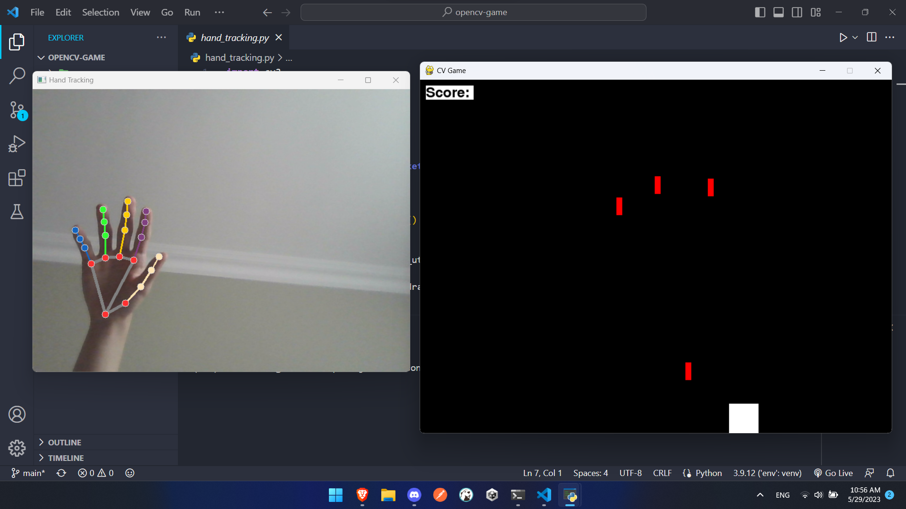

# Pygame Hand Dodger Game



This is a hand-controlled dodging game built with Pygame, where the player uses hand tracking to control a character and dodge projectiles. The game demonstrates the integration of computer vision techniques with game development, making it an engaging and interactive experience.

## Features

- Real-time hand tracking using the Mediapipe library.
- Hand gestures mapped to the player's movement for an immersive gaming experience.
- Dynamic spawning of projectiles from the top of the screen.
- Score tracking for each successful dodge of a projectile.
- Socket communication

## Communication using Sockets

This game utilizes TCP sockets for communication between the hand-tracking and game modules. The hand tracking module continuously sends the x-coordinate of the index finger to the game module, which uses this information to control the player's movement.

The communication flow is as follows:

1. The hand-tracking module runs in parallel with the game module.
2. The hand tracking module tracks the hand movements and extracts the x-coordinate of the index finger.
3. The hand-tracking module establishes a TCP connection with the game module.
4. It sends the x-coordinate of the index finger through the TCP socket to the game module.
5. The game module receives the x-coordinate and updates the player's position accordingly.
6. The game module renders the updated game frame based on the player's position.
7. Steps 4-6 are repeated continuously to provide real-time control of the player.

Using sockets allows for seamless communication and synchronization between the hand-tracking module and the game module, enabling the player to control the game in real-time using hand gestures.

Please note that the socket communication is implemented using the Python `socket` library, and the necessary code for establishing and managing the socket connection is already provided in the project files.

## Requirements

- Python 3.7 - 3.9 (higher versions don't work with this Mediapipe code)
- Pygame library
- Mediapipe library

## Installation

1. Clone or download this repository to your local machine.

2. Create a virtual environment (optional but recommended):

```
$ python3 -m venv env
$ source env/bin/activate
```
3. Install the required dependencies using pip:
```
$ pip install -r requirements.txt
```


## Usage

1. Run the hand tracking code:
- Open a terminal and navigate to the directory where you cloned/downloaded this repository.
- Run the following command to start the hand-tracking code:
  ```
  $ python hand_tracking.py
  ```
- Keep this hand-tracking code running in the background while playing the game.

2. Run the game:
- Open a new terminal and navigate to the directory where you cloned/downloaded this repository.
- Run the following command to start the game:
  ```
  $ python game.py
  ```
- The game window will open, and you can control the player's movement by moving your hand.

3. Play the game:
- Dodge the projectiles by moving the player character using your hand.
- The game ends if the player collides with a projectile.
- Aim for a high score and challenge yourself to improve your dodging skills!

## Customization

Feel free to customize the game to suit your needs or add additional features. The code provides a solid foundation that can be extended or modified to showcase your creativity and programming skills. You can experiment with different game mechanics, graphics, and sound effects, or even implement multiplayer functionality.

## Showcase

This project demonstrates the integration of computer vision and game development, highlighting skills in Python programming, computer graphics, and human-computer interaction. Hand-tracking technology adds an innovative and interactive element to the game.
